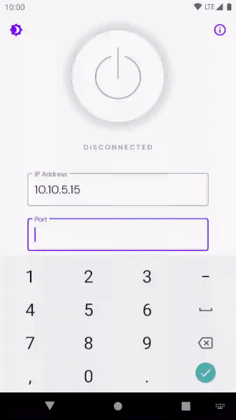
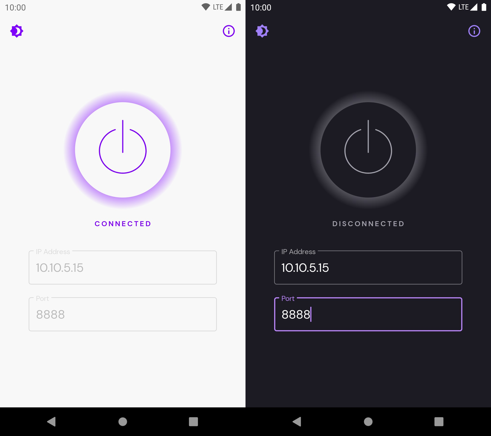
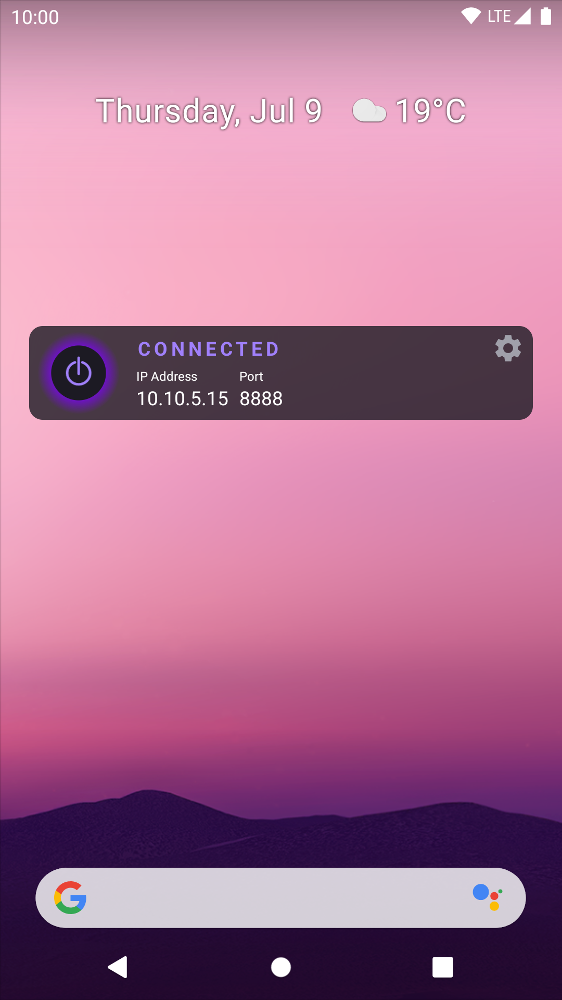
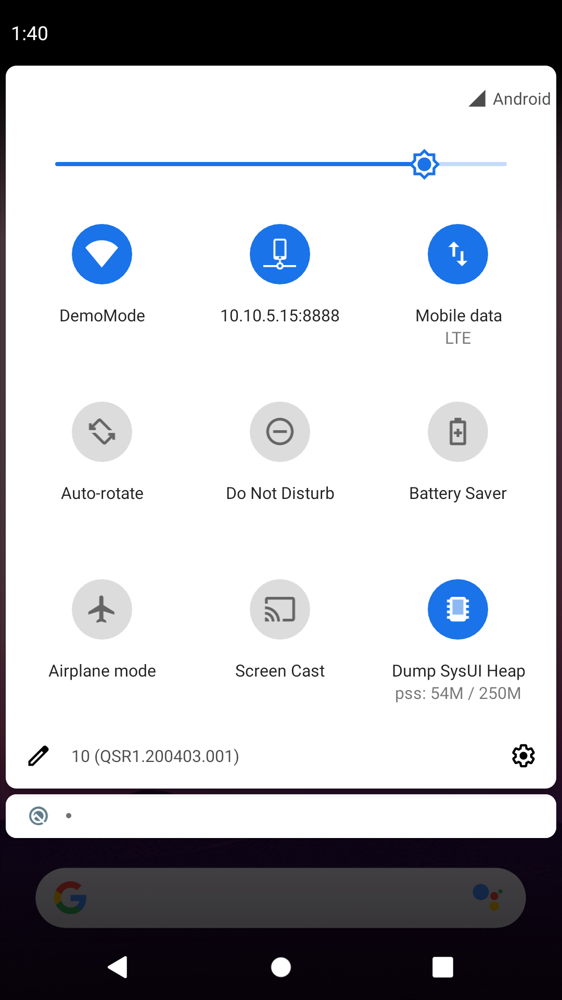

<p align="center">
  
  
  
  
</p>

# Proxy Toggle

一个小型应用，帮助 Android 开发与测试工程师快速启用/禁用全局代理设置，避免在繁琐的系统网络设置路径中来回查找。

### 该 App 的作用

- 针对有旁路由，局域网内或者服务器部署了代理设置并且暴露了代理端口的用户
- 修改于开源项目，增加了对 IPv6、域名的支持

---

<p align="center">
  
</p>

**请将本文件的更新视为每次发布的一部分；如果发现内容需要更新，也请及时维护。**

## 应用安装

如果你只想使用该应用，可以下载[最新发布版本](https://github.com/yzmninglang/proxy-toggle)，连接设备后在终端执行安装脚本：

```bash
./installAndGrantPermission.sh
```

### Android 5.x

由于旧版 `adb` 的限制，如果要在 Android 5.x 设备上安装应用，需要分别执行以下两条命令：

```bash
adb install -t -r proxy-toggle.apk
adb shell pm grant com.kinandcarta.create.proxytoggle android.permission.WRITE_SECURE_SETTINGS
```

## 项目设置

无需额外的特殊配置。克隆仓库后即可直接构建。
编写本文档时，项目使用 Android Studio 4.2 Canary 3 创建。

## 关于应用

### 支持设备

本应用支持 Android 5.0 及以上版本。

### 架构

项目包含一个较小的 `app` 模块，不同功能（管理页面、小组件、快捷设置磁贴）分别在各自模块中实现。多个模块共享的内容放在 `core` 模块中。最后，还有一个 `test-utils` 模块用于存放各模块测试源码树中复用的测试工具。

应用遵循 MVVM Clean Architecture 原则。

### 依赖注入

当前使用 [Hilt](https://developer.android.com/training/dependency-injection/hilt-android) 进行依赖注入。
使用 DI 的每个 Activity 与 Fragment 都必须添加 `@AndroidEntryPoint` 注解。
每个 ViewModel 必须通过 `@ViewModelInject` 注入，才能使用 `by viewModels()` 提供实例。

### 测试

我们使用 Github Actions 对所有提交到 `main` 分支的 PR 执行项目全部单元测试。
项目已配置 JaCoCo 进行测试覆盖率统计。我们应在每个 PR 中持续提升覆盖率。
编写本文档时，Hilt 与 JaCoCo 尚未完全兼容，因此显示的总覆盖率并不完全准确。

### 功能

#### 快速代理设置

<p align="center">
  
</p>

简单配置：输入目标 IP 与端口，启用代理后即可生效，整台设备流量都会走代理。

#### 主屏幕小组件（Home Screen Widget）

<p align="center">
  
</p>

应用提供主屏幕小组件，用户可以直接使用上一次配置快速开关代理，无需打开应用。
如有需要，也可以通过小组件启动应用进行代理配置。

#### 快捷设置磁贴（Quick Setting Tile）

<p align="center">
  
</p>

与小组件类似，Android 7.0 及以上用户可以在通知抽屉中添加快捷设置磁贴。
该磁贴允许用户在不离开当前应用的情况下切换代理。

## 注意事项

### WRITE_SECURE_SETTINGS 权限

应用会使用 [Settings.Global](https://developer.android.com/reference/android/provider/Settings.Global)。由于这是系统级设置，默认通常为只读。
此限制可通过授予应用 `WRITE_SECURE_SETTINGS` 特殊权限来绕过。

> 注意：这是受保护权限，通常只应授予系统应用。给未知来源应用授予该权限时请务必谨慎。

安装应用后，如需手动授权，请连接设备并在终端执行：

```bash
adb shell pm grant com.kinandcarta.create.proxytoggle android.permission.WRITE_SECURE_SETTINGS
```

此外，你也可以在安装时通过命令 `adb install -g App.apk` 授权，或直接使用提供的 `installAndGrantPermission.sh` 脚本。

### 卸载应用时请谨慎

如果在代理开启状态下卸载应用，设备会永久保留该代理配置（因为它写入的是 `Settings.Global`）。

> 卸载前请务必确认代理已关闭！

考虑到无法完全保证这一点，我们还提供了 `uninstallAndCleanUp.sh` 脚本，帮助你在卸载后确保设备处于干净状态。

你也可以在终端手动执行以下命令清理代理设置：

```bash
adb shell settings delete global http_proxy
adb shell settings delete global global_http_proxy_host
adb shell settings delete global global_http_proxy_port
```

## 致谢

本项目基于开源项目 [android-proxy-toggle](https://github.com/theappbusiness/android-proxy-toggle) 修改，感谢原作者的贡献。

## 许可证

Proxy Toggle 基于 MIT 许可证发布。详情见 [LICENSE](LICENSE.md)。
